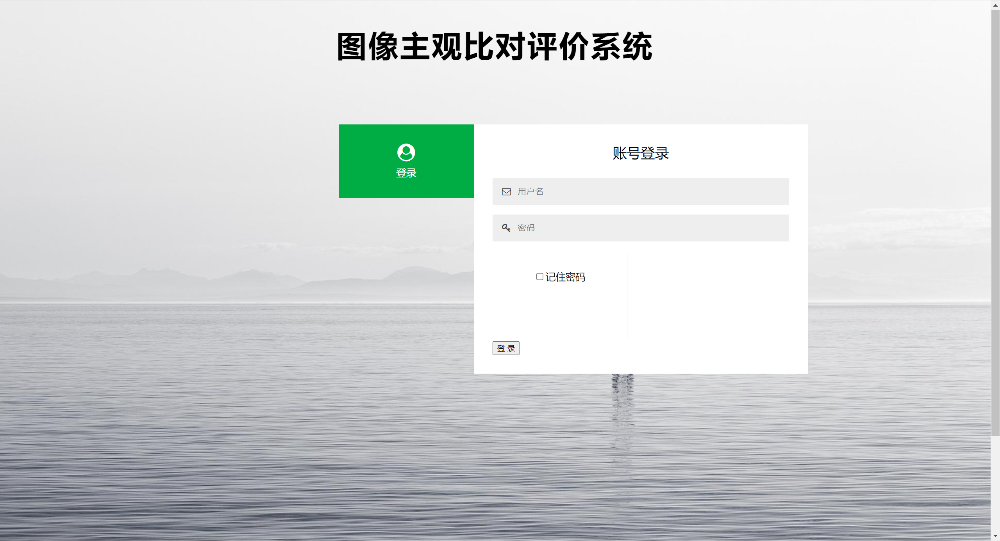

# 基于Flask框架开发的轻量化图像比对系统

## 1. 实现功能
- 多用户登录功能
- 多地登录自动下线功能
- 密码保存功能
- 多用户对比图片评分功能
- 对比图片放大功能
- 评分结果统计和展示功能

## 2. 依赖库

- Flask==2.1.0

- scikit_learn==1.1.1

## 3. 用法

### 3.1 用户账号管理

所有用户账号信息存放在 ```./source/database/userInfo.db```中

可以通过```./utils/checkUseInfo.py```中的代码进行管理

目前没有实现用户信息管理平台

### 3.2 对比系统数据准备

所有需要对比的图片数据应该存放在```./imgCompareSystem/source/ImgTest```中，新建的任意名称文件夹(假设为Test)中

对于每一个需要比对的Case，需要在Test目录下再次新建文件夹(如Case01)，里面存放两张图片，对于GT图片，必须含有```GT```关键字，非GT则不应含有```GT```关键字

修改```./imgCompareSystem/main_flask.py```中的compareImgDatabase参数值为第一步创建的文件夹名称(Test)

运行如下指令即可

```
cd ./imgCompareSystem/
bash start.sh
```

所有log会输出致```./imgCompareSystem/test.log```

如遇Bug，可前往[GitHub](https://github.com/chencn2020/imgCompare/issues)上提issue

## 4.界面展示

### 4.1 登录界面



后续会对系统进行不断优化，敬请关注